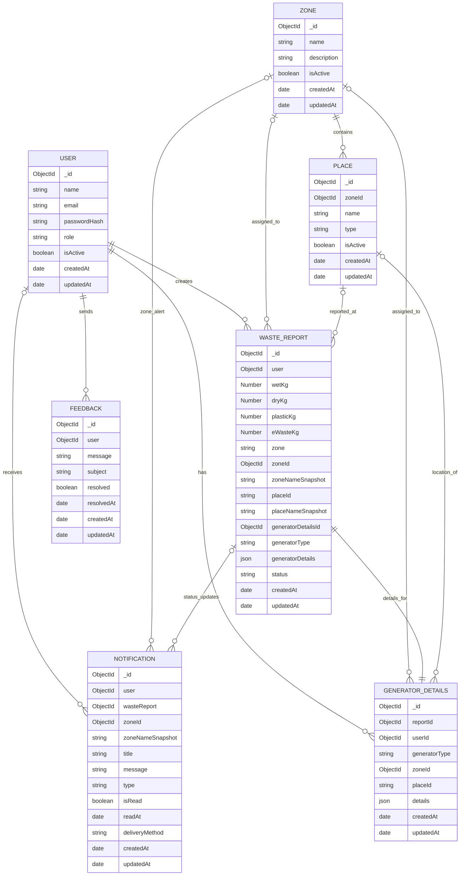

```mermaid
erDiagram
  USER {
    ObjectId _id
    string name
    string email
    string passwordHash
    string role
    boolean isActive
    date createdAt
    date updatedAt
  }

  WASTE_REPORT {
    ObjectId _id
    ObjectId user
    Number wetKg
    Number dryKg
    Number plasticKg
    Number eWasteKg
    string zone
    ObjectId zoneId
    string zoneNameSnapshot
    string placeId
    string placeNameSnapshot
    ObjectId generatorDetailsId
    string generatorType
    json generatorDetails
    string status
    date createdAt
    date updatedAt
  }

  ZONE {
    ObjectId _id
    string name
    string description
    boolean isActive
    date createdAt
    date updatedAt
  }

  PLACE {
    ObjectId _id
    ObjectId zoneId
    string name
    string type
    boolean isActive
    date createdAt
    date updatedAt
  }

  GENERATOR_DETAILS {
    ObjectId _id
    ObjectId reportId
    ObjectId userId
    string generatorType
    ObjectId zoneId
    string placeId
    json details
    date createdAt
    date updatedAt
  }

  NOTIFICATION {
    ObjectId _id
    ObjectId user
    ObjectId wasteReport
    ObjectId zoneId
    string zoneNameSnapshot
    string title
    string message
    string type
    boolean isRead
    date readAt
    string deliveryMethod
    date createdAt
    date updatedAt
  }

  FEEDBACK {
    ObjectId _id
    ObjectId user
    string message
    string subject
    boolean resolved
    date resolvedAt
    date createdAt
    date updatedAt
  }

  %% Relationships
  USER ||--o{ WASTE_REPORT : creates
  USER ||--o{ FEEDBACK : sends
  USER ||--o{ GENERATOR_DETAILS : has
  USER |o--o{ NOTIFICATION : receives

  ZONE ||--o{ PLACE : contains
  ZONE |o--o{ WASTE_REPORT : assigned_to
  ZONE |o--o{ GENERATOR_DETAILS : assigned_to
  ZONE |o--o{ NOTIFICATION : zone_alert

  WASTE_REPORT ||--|| GENERATOR_DETAILS : details_for
  WASTE_REPORT |o--o{ NOTIFICATION : status_updates

  PLACE |o--o{ WASTE_REPORT : reported_at
  PLACE |o--o{ GENERATOR_DETAILS : location_of
```
